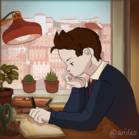
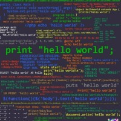
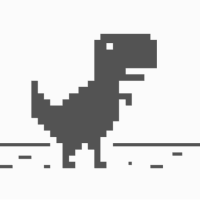
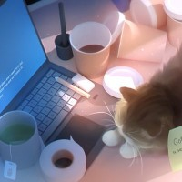
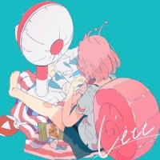

# L'équipe Lostaria

::: tip Sommaire
[[toc]]
:::

## Les développeurs
### Worsewarn

A l'origine du projet, Worsewarn continue de développer Lostaria et de le maintenir depuis plus de 4 ans. Il est le créateur de la grande majorité des mini-jeux.

 

### Erpriex

Erpriex développe des fonctionnalités internes au serveur et s'occupe de l'infrastructure afin de garantir que Lostaria soit toujours fonctionnel et performant. Il est également le créateur du site de statistiques.

> Twitter [@Erpriex](https://twitter.com/Erpriex) 
> Site web [erpriex.fr](http://erpriex.fr)

 

### Lara

Convaincue que le hub soit un véritable terrain de jeux, Lara est à l'origine du développement de la discothèque, de la pêche, et du dé-à-coudre.

> Twitter [@ElloWorld01](https://twitter.com/ElloWorld01)

 

### lumin0u

lumin0u intervient sur le développement de Lostaria depuis 2 ans. Il a notamment développé quelques jeux, comme le Arrow et le PloufCraft !

> Twitter [@lumin00u](https://twitter.com/lumin00u)

  

## Les constructeurs
### Nekou

Le build est le passe-temps favoris de Nekou. Il a construit un bon nombre de maps pour Lostaria, notamment en Pitchout et Runaway !

> Twitter [@Yumi_lychee](https://twitter.com/Yumi_lychee)

 

### XEL0

D'une passion incontestable pour les maths, XEL0 réunit théorèmes et manuels pour vous construire les maps de vos rêves ! Il est notamment à l'origine de la réalisation du hub.

> Twitter [@XEL0_](https://twitter.com/XEL0_)